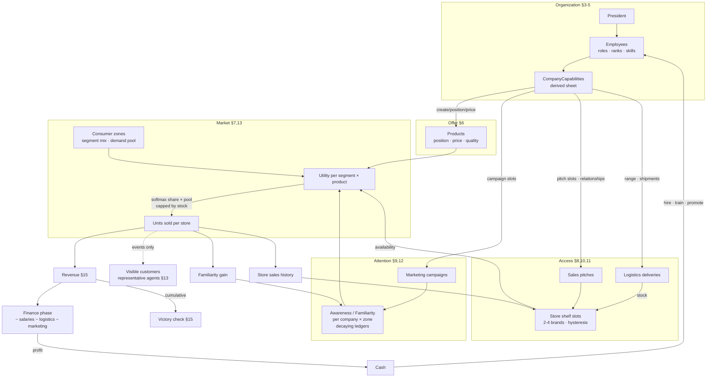

# Company Economy — System Map v1

How every system feeds the next. Companion to `company-economy-master-foundation-v1.md`
(section numbers in parentheses refer to that document's topics; the flow below is
President → Organization → Capabilities → Product Strategy → Marketing → Awareness/Demand
→ Sales → Store Access → Logistics → Availability → Consumer Purchase → Revenue →
Reinvestment → Company Growth).

## The engine loop

## Reading the map

- **Left-to-right is the player's build order**; the loop closes when profit re-enters the
  org. Growth is never free: every capability node a player strengthens (org, marketing,
  sales, logistics) adds recurring cost in the Finance node.
- **Three contested bottlenecks** decide the game — attention (awareness ledgers), access
  (shelf slots), and demand (zone pools). All three are shared/finite, so every improvement
  is implicitly *against* the other companies.
- **Dashed edge = render-only**: visible customers consume sales events and never feed
  anything back. Cutting that edge changes nothing economically — which is exactly why it is
  safe for performance and multiplayer.
- **Decay arrows keep it dynamic** (§12): Awareness/Familiarity/Relationships all leak each
  round, so first-to-market momentum must be re-earned, never banked permanently.

## Phase timing over the same graph

| Phase (§14) | Nodes written |
|---|---|
| PLAN | Employees, Capabilities |
| POSITION | Products |
| MARKET | Campaigns → Awareness |
| SELL-IN | Pitches → Shelf; Deliveries → Stock |
| CONSUME | Utility → Units sold → events (visual layer) |
| FINANCE | Revenue, Cash, Victory check |

## Competitive pressure points (where players collide)

1. **Shelf slots** — zero-sum per store; hysteresis ×1.15 protects incumbents (§8).
2. **Segment demand pools** — softmax share: your utility only matters relative to rivals (§13).
3. **Attention share** — awareness is per-company but purchase weighting normalizes across
   competitors present in the zone (§9).
4. **Store relationships** — capped, decaying, and only as wide as sales headcount (§10).
5. **Tie contention** — exact score ties resolve by rotating initiative (§14), never dice.
